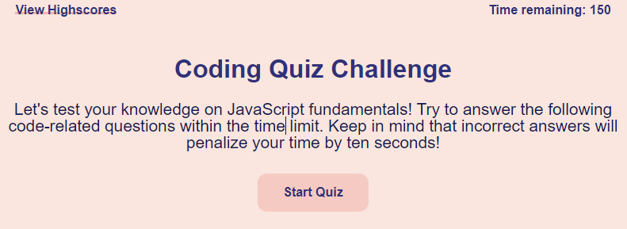

# Code Quiz

## Name
JavaScript Code Quiz

## Description
This program generates a JavaScript quiz in which you have 150 seconds to answer all the questions. When you answer a question correctly, you receive 1 point. When you answer a question incorrectly, 10 seconds gets deducted from the total time. At the end of the quiz, you can input your initials to store your score, and you can go back and try the quiz again to see if you get a better score.
To view in pages, click [here](https://sifrult.github.io/code-quiz/)

## Visuals

